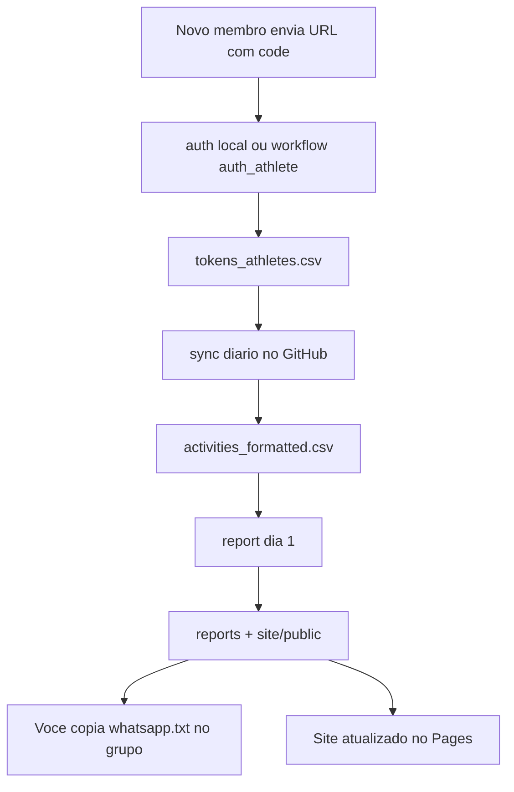

# Estrutura do projeto Flat & Furious

Este documento explica cada pasta do repositorio, o que deve conter e o que voce deve fazer em cada uma.

## Visao geral

```
Flat_and_Furious/
├── flatfurious/          # Codigo Python do pipeline (uso principal)
├── data/                 # Dados Strava (CSV) — repositorio PRIVADO
├── reports/              # Relatorios mensais gerados
├── site/                 # Site estatico (templates + publicacao)
├── .github/workflows/    # Automacao no GitHub Actions
├── docs/                 # Documentacao
├── legacy/               # Notebooks e scripts antigos (referencia)
├── Notebooks/            # Notebooks originais (legado, nao usar no dia a dia)
├── .env.example          # Modelo de configuracao
└── README.md             # Inicio rapido
```

---

## `flatfurious/` — Motor do sistema

**O que e:** Pacote Python com toda a logica que antes estava nos Jupyter notebooks.

| Subpasta | Funcao |
|----------|--------|
| `strava/auth.py` | Troca o `code` da URL Strava por tokens e grava no CSV |
| `strava/refresh.py` | Renova tokens expirados |
| `strava/collect.py` | Baixa atividades da API (incremental) |
| `data/clean.py` | Limpa CSV bruto → `activities_formatted.csv` |
| `report/monthly.py` | Calcula rankings, curiosidades, `summary.json` |
| `report/whatsapp.py` | Gera `whatsapp.txt` para copiar no grupo |
| `report/charts.py` | Gera `infographic.png` |
| `site/build.py` | Monta HTML em `site/public/` |

**O que fazer:** Nao editar no dia a dia. Use a CLI:

```bash
python -m flatfurious sync
python -m flatfurious auth --code "URL_OU_CODE"
python -m flatfurious report --month 2025-08 --build-site
```

---

## `data/` — Dados sensiveis

**O que e:** Arquivos CSV usados pelo pipeline.

| Arquivo | Conteudo | Quem atualiza |
|---------|----------|---------------|
| `tokens_athletes.csv` | Tokens OAuth de cada membro | `auth` ou workflow `auth_athlete` |
| `activities_all.csv` | Resposta bruta da API Strava | `sync` (diario no CI) |
| `activities_formatted.csv` | Dados limpos para relatorios | `sync` |

**O que fazer:**

- Manter o repositorio **privado** no GitHub (tokens sao secretos).
- Nunca commitar `.env` com `CLIENT_SECRET`.
- Apos cada novo membro: `python -m flatfurious auth --code "..."`.

---

## `reports/` — Saida mensal

**O que e:** Uma pasta por mes (`YYYY-MM`) com:

- `summary.json` — dados do resumo (ranking, km, curiosidades)
- `whatsapp.txt` — texto pronto para o grupo
- `infographic.png` — imagem para anexar no WhatsApp

**O que fazer:** Gerado automaticamente pelo comando `report` ou workflow **Monthly report**. Voce so copia `whatsapp.txt` e a imagem para o WhatsApp.

---

## `site/` — Site do grupo

| Pasta | Funcao |
|-------|--------|
| `templates/` | HTML/CSS Jinja2 (editar layout aqui) |
| `public/` | Site gerado — **esta pasta vai para o GitHub Pages** |

**O que fazer:**

1. Ajustar visual em `templates/` se quiser.
2. Rodar `python -m flatfurious report --build-site` ou esperar o CI.
3. No GitHub: Settings → Pages → Source: **GitHub Actions**.

URL tipica: `https://SEU_USUARIO.github.io/Flat_and_Furious/`

---

## `.github/workflows/` — Automacao online

| Workflow | Quando roda | Acao |
|----------|-------------|------|
| `daily_sync.yml` | Todo dia 06:00 UTC | Sync Strava + commit CSVs |
| `monthly_report.yml` | Dia 1, 08:00 UTC | Relatorio + site + artefatos WhatsApp |
| `deploy_pages.yml` | Push em `site/public` | Publica o site |
| `auth_athlete.yml` | Manual | Registra novo membro com `auth_code` |

**O que fazer (uma vez):**

1. Criar repo **privado** no GitHub.
2. Secrets: `CLIENT_ID`, `CLIENT_SECRET`.
3. Variable (opcional): `SITE_BASE_URL`.
4. Habilitar Pages (GitHub Actions).

---

## `docs/` — Documentacao

- `ESTRUTURA_DO_PROJETO.md` — este arquivo
- Ver tambem `ONBOARDING.md` na raiz para cadastro de atletas

---

## `legacy/` — Arquivo historico

Notebooks e experimentos antigos movidos da raiz. **Nao fazem parte do fluxo automatizado.** Use apenas se quiser consultar a logica original.

---

## `Notebooks/` — Legado

Notebooks Jupyter da fase inicial. O fluxo oficial e `python -m flatfurious`. O `.env` antigo pode estar aqui — prefira `.env` na **raiz** do projeto.

---

## `out/` — Saidas antigas

Graficos gerados manualmente antes do pipeline. Podem ser ignorados ou arquivados em `legacy/`.

---

## Fluxo recomendado (mensal)



---

## Comandos rapidos

| Objetivo | Comando |
|----------|---------|
| Sincronizar Strava | `python -m flatfurious sync` |
| Registrar membro | `python -m flatfurious auth --code "http://auth.flatandfurious/?code=..."` |
| Relatorio do mes | `python -m flatfurious report --month 2025-08 --build-site` |
| So atualizar site | `python -m flatfurious site-build` |

---

## Ligacao com GitHub

Veja `docs/GITHUB.md` para inicializar o repositorio, primeiro push e configuracao de secrets.
